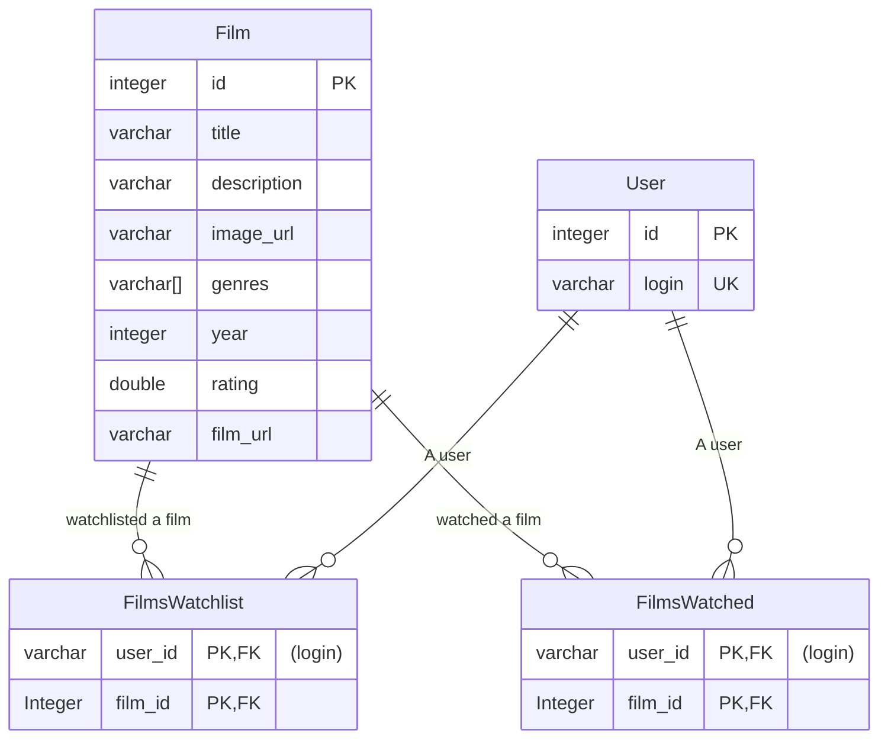
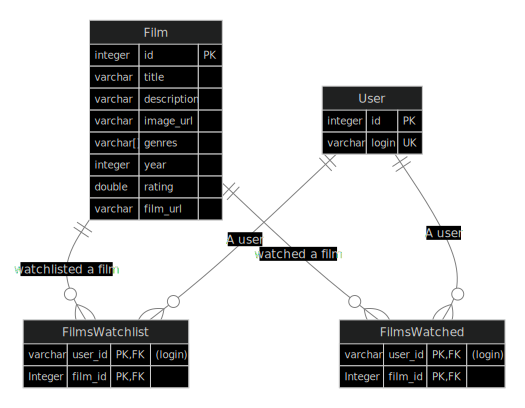

# Supernova | Backend

## 1. Архитектура


## 2. Структура проекта

| Path            | Description                                              |
| --------------- | -------------------------------------------------------- |
| `integrations/` | Сторонние интеграции (ИИ, Kinopoisk API, ...)            |
| `routers/`      | API бэкенда                                              |
| `services/`     | Внутренние сервисы (БД, кэш, статическое хранилище, ...) |
| `login_manager` | Auth для пользователей                                   |

### Сервисы

- FastAPI
- Postgres | БД для юзеров и фильмов
- Redis | Кэш для сессий (совместных просмотров)
- MinIO | Хранение превью и постеров фильмов
- Nginx | Обертка в SSL и роутинг

Всё производится при помощи соответствующих библиотек (SQLModel, Redis, Minio)

## 3. База данных

База данных - PostgresQL



<details>
<summary>Если диаграмма не работает</summary>



</details>

## 4. Pipeline

Файл CI: [.gitlab-ci.yml](./.gitlab-ci.yml)

stages:
1. `tests_e2e` | E2E тесты tavern (только на пуш в dev)
2. `tests_unit` | Unit тесты (WIP)
3. `deploy_prod` | Деплой на виртуалку (только на пуш в master)

## 5. Последний успешный pipeline

TBD

## 6. OpenAPI

Файл OpenAPI: [openapi.json](./openapi.json)

## 7. Swagger UI

https://prod-team-40-jpqgdebk.REDACTED/docs

## 8.

JSON фильмов:

```
{
 "title": "Человек-паук: Паутина вселенных",
 "description": "После воссоединения с Гвен Стейси дружелюбный сосед Человек-Паук попадает из Бруклина в Мультивселенную, где встречает команду Паучков, защищающих само её существование. Пытаясь справиться с новой угрозой, Майлз сталкивается с Пауками из других вселенных. Настаёт момент, когда ему необходимо решить, что значит быть героем, спасающим тех, кого любишь больше всего.",
 "image_url": "https://avatars.mds.yandex.net/get-ott/1648503/2a0000018a994536f9edc10739a4237764f7/orig",
 "year": 2023,
 "film_url": "https://www.kinopoisk.ru/film/1219177/",
 "genres": [
   "фантастика",
   "приключения",
   "боевик",
   "фэнтези",
   "мультфильм",
   "семейный"
 ],
 "rating": 8.4
}
```

```
{
 "title": "Человек-паук 2",
 "description": "Тихоня Питер Паркер балансирует на грани двух своих жизней: супергероя Человека-паука и обычного студента колледжа. Его отношения со всеми, кто ему дорог, в опасности или зашли в тупик. А жизнь приготовила ему новое испытание. Он должен использовать все свои суперспособности, чтобы одолеть жестокого безумца доктора Отто Октавиуса.",
 "image_url": "https://avatars.mds.yandex.net/get-ott/1672343/2a0000017c08123dd3ddd2d7a062a1e7f95a/orig",
 "year": 2004,
 "film_url": "https://www.kinopoisk.ru/film/2898/",
 "id": 2898,
 "genres": [
   "фантастика",
   "приключения",
   "боевик"
 ],
 "rating": 7.4
}
```

```
{
 "title": "Супермен, Человек-паук или Бэтмен",
 "description": "Вдохновленный любимыми героями комиксов, мальчик решает спасти свою маму.",
 "image_url": "https://kinopoiskapiunofficial.tech/images/posters/kp/642446.jpg",
 "year": 2011,
 "film_url": "https://www.kinopoisk.ru/film/642446/",
 "genres": [
   "драма",
   "короткометражка"
 ],
 "rating": 7.7
}
```


## 9. Telegram bot

--

## 10. Тестовые сценарии 

E2E: `./tests/e2e`

## 11. Покрытие

Эндпойнты:
- /auth...
- /profile...
- /watched...
- /watchlist...

Интеграции:
- Gemini
- Kinopoisk
